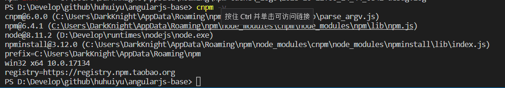

# 开发说明文档

## 环境检查

- nodejs是否安装，在控制台执行`node -v`查看nodejs是否安装，正确会显示版本号，必须大于等于8
- cnpm是否安装，在控制台执行`cnpm -v`查看cnpm是否安装，正确会显示类似下图效果    
  

- gulp是否安装，在控制台执行`gulp -v`查看gulp是否安装，正确会显示版本号
- 这里要添加安装node和cnpm的文档链接
  
## 项目初始化

- 初始化仅需要执行一次
- 控制台中执行`cnpm install`安装项目依赖
- 在控制台执行`gulp`初始化项目打包
- 上面执行成功，项目中会出现`node_modules`和`dist`文件夹
- 配置文件路径修改
  - 修改[browser.js](../browser.js)中浏览器执行文件的路径
  - 修改[nginx-start.bat](../nginx-start.bat)中的 nginx 所在路径
  - 修改[nginx-stop.bat](../nginx-stop.bat)中的 nginx 所在路径
  - 在[nginx](../nginx)目录中创建`temp`和`logs`目录

  